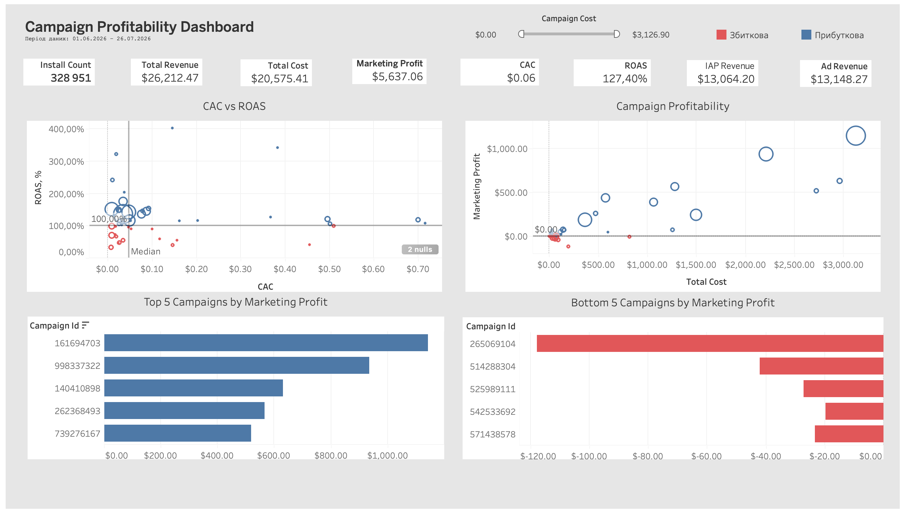

# Mornhouse — аналіз прибутковості рекламних кампаній
## Робочий журнал аналізу (methodology log)

> Правило ведення цього журналу: гіпотеза фіксується ДО запуску запиту, висновок — одразу ПІСЛЯ. Не переписувати заднім числом.

---

## 1. Контекст і бізнес-питання

- **Мета:** побудувати єдину вітрину, яка показує прибутковість рекламних кампаній Mornhouse (cost vs revenue), і на її основі — дашборд у Tableau.
- **Що вважаємо "прибутковою кампанією":** визначення метрики буде зафіксовано в розділі 6, коли стане зрозуміло, які дані реально доступні для розрахунку доходу.
- **Джерела:** BigQuery, проєкт `mornhouse-test-environment`, датасет `test_app_dataset`, доступ viewer.
- **Заявлений період даних:** червень–липень 2026 (буде звірено з фактичними даними в кожній таблиці).
**Примітка щодо методу:** у реальному проєкті першим кроком був би запит документації/data dictionary, перш ніж витрачати час на реверс-інжиніринг структури й бізнес-логіки. У межах цього тестового завдання - самостійний data profiling з нуля.
---

## 2. Аудит вихідних даних (Data Profiling)

Мета етапу: зрозуміти grain, обсяг, діапазон дат і якість потенційних ключів кожної таблиці окремо. Усі запити — в `sql/01_profiling.sql`, з коментарями, що пояснюють кожен крок і його результат.

### 2.1 non_org_installs_report

**Query 1 — базові метрики:** `sql/01_profiling.sql` — секція `non_org_installs_report`
| min_install_date | max_install_date | row_count | distinct_campaigns | distinct_media_sources | null_campaign_id | null_campaign_id_pct |
|---|---|---|---|---|---|---|
| 2026-06-01 | 2026-07-26 | 777724 | 54 | 3 | 448708 | 57.7% |

**Query 2 — аудит кандидатів на join-ключ (з відсотками):**
| row_count | analytics_installation_id_non_null | analytics_installation_id_pct | analytics_installation_id_distinct | advertising_id_non_null | advertising_id_pct | advertising_id_distinct |
|---|---|---|---|---|---|---|
| 777724 | 0 | 0.0% | 0 | 489544 | 62.9% | 473477 |

| firebase_app_id_non_null | firebase_app_id_pct | firebase_app_id_distinct | appsflyer_id_non_null | appsflyer_id_pct | appsflyer_id_distinct |
|---|---|---|---|---|---|
| 777724 | 100.0% | 777724 | 0 | 0.0% | 0 |

**Висновок:**
- Grain: одна подія атрибутованого інсталу.
- Діапазон дат (2026-06-01 – 2026-07-26) — базовий орієнтир для звірки з іншими таблицями.
- `analytics_installation_id` і `appsflyer_id` — 100% NULL, непридатні як join-ключ.
- `advertising_id` — заповнений на 62.9%, робочий, непридатний як join-ключ.
- **`firebase_analytic_app_id` — 100% заповнений, унікальний на рядок. Кандидат на join-ключ рівня пристрою.**
- 54 кампанії, 3 media_source — орієнтир для звірки з cost_table.
- **57.7% install-подій (448708 з 777724) не мають campaign_id взагалі** — важлива знахідка: атрибуція на рівні кампанії доступна лише для 42.3% інсталів періоду кампаній.
**Гіпотези, що виникли:** розділ 3, №1 , №2.

### 2.2 cost_table

**Query 1 — базові метрики:** `sql/01_profiling.sql` — секція `cost_table`
| min_date | max_date | row_count | distinct_apps | distinct_campaigns | distinct_media_sources | null_campaign_id | null_media_source |
|---|---|---|---|---|---|---|---|
| 2026-06-01 | 2026-07-26 | 5253424 | 1 | 48 | 1 | 0 | 0 |

**Query 2 — звірка media_source з non_org_installs_report:**
| source_table | media_source | row_count |
|---|---|---|
| cost_table | googleadwords_int | 5253424 |
| non_org_installs_report | googleadwords_int | 416142 |
| non_org_installs_report | other | 95528 |
| non_org_installs_report | unknown | 266054 |

**Висновок:**
- Діапазон дат повністю збігається з non_org_installs_report.
- row_count значно більший за installs — grain тут campaign × geo × day.
- distinct_campaigns = 48 vs 54 в installs — розбіжність, причина не з'ясована.
- distinct_media_sources = 1 vs 3 в installs — важлива знахідка, cost_table покриває лише `googleadwords_int`. `other`/`unknown` — ймовірно службові категорії атрибуції, не платні мережі (гіпотеза).
- `campaign_id`/`media_source` структурно чисті (без NULL).

**Гіпотези, що виникли:** розділ 3, №3, №4.

### 2.3 ad_revenue_raw

**Query:** `sql/01_profiling.sql` — секція `ad_revenue_raw`
**Результат:**
| min_event_date | max_event_date | row_count | distinct_apps | distinct_campaigns | distinct_media_sources | null_campaign_id | null_campaign_id_pct |
|---|---|---|---|---|---|---|---|
| 2026-06-01 | 2026-07-26 | 5955170 | 1 | 137 | 3 | 351694 | 5.9% |

| distinct_analytics_installation_id | null_analytics_installation_id_pct | distinct_firebase_app_id | null_firebase_app_id_pct | distinct_advertising_id | null_advertising_id_pct | distinct_appsflyer_id | null_appsflyer_id_pct |
|---|---|---|---|---|---|---|---|
| 0 | 100.0% | 268249 | 0.0% | 242204 | 6.3% | 0 | 100.0% |

**Висновок:**
- Діапазон дат збігається з іншими таблицями.
- Grain: одна подія показу/завершення реклами — набагато більший обсяг.
- `null_campaign_id = 351694` (~5.9%) — частина подій доходу не атрибутована.
- `distinct_campaigns = 137` > 54 (installs), > 48 (cost) — гіпотеза про когорти різної зрілості (дохід від installs до початку періоду).
- `firebase_analytic_app_id` — 268249 distinct, 0% NULL, узгоджено з installs (~22 події на пристрій) — підтверджує гіпотезу №2. 
- `analytics_installation_id`/`appsflyer_id` — 100% NULL.

**Гіпотези, що виникли:** розділ 3, №2 (додатково підтверджено), №6 .

### 2.4 in_app_events_report

**Query 1 — базові метрики:** `sql/01_profiling.sql` — секція `in_app_events_report`
**Результат:**
| min_event_date | max_event_date | row_count | distinct_apps | distinct_campaigns | distinct_media_sources | null_campaign_id | null_campaign_id_pct |
|---|---|---|---|---|---|---|---|
| 2026-06-01 | 2026-07-26 | 24963 | 1 | 91 | 3 | 2713 | 10.9% |

| firebase_app_id_non_null | firebase_app_id_pct | firebase_app_id_distinct | advertising_id_non_null | advertising_id_pct | advertising_id_distinct | distinct_event_names |
|---|---|---|---|---|---|---|
| 23943 | 95.9% | 14115 | 21484 | 86.1% | 12680 | 10 |

**Query 2 — дохід по типах подій:**
| event_name | row_count | total_revenue | null_revenue | voided_count |
|---|---|---|---|---|
| trial_started | 6866 | — | 6866 | 0 |
| subscription_billing_grace | 6179 | — | 6179 | 0 |
| trial_churned | 6064 | — | 6064 | 0 |
| subscription_renewed | 2021 | 41098.97 | 0 | 0 |
| trial_canceled | 2017 | — | 2017 | 0 |
| trial_converted | 679 | 21308.24 | 0 | 0 |
| subscription_canceled | 512 | — | 512 | 0 |
| subscription_churned | 422 | — | 422 | 0 |
| subscription_refunded | 189 | −6014.65 | 0 | 189 |
| no_trial_sub_started | 14 | 95.83 | 0 | 0 |

**Висновок:**
- Grain: одна подія в життєвому циклі підписки/покупки. Малий обсяг.
- `null_campaign_id` — найвищий серед усіх таблиць (~10.9%).
- `distinct_campaigns = 91` — точка в послідовності 54 → 48 → 91 → 137 (гіпотеза №6).
- Лише 4 з 10 `event_name` несуть дохід; `SUM(event_revenue_usd)` без фільтрів коректний (NULL ігнорується, refund зі знаком мінус).
- Перевірка дублікатів рядків — розділ 2.5.

**Гіпотези, що виникли:** розділ 3, №6.

## 2.5 Перевірка якості даних (Data Quality Checks)

### Дублікати рядків (in_app_events_report)

**Query 1 (крок 1) — групування лише по order_id:** `sql/02_data_quality.sql`
Сотні order_id з 4-5 рядками — це стадії життєвого циклу підписки, не дублікати.

**Query 2 (крок 2) — точний natural key (order_id + event_name + timestamp + event_revenue_usd):** `sql/02_data_quality.sql`
Виявила справжні дублікати рядків, включно з revenue-bearing подіями.

**Query 3 — кількісна оцінка впливу на дохід:**
| duplicate_groups | total_duplicate_rows | excess_rows | excess_revenue_impact |
|---|---|---|---|
| 36 | 74 | 38 | −$218.98 |

**Висновок:** Дублікати переважно серед `subscription_refunded` (від'ємні суми), без дедуплікації,  при викристанні SUM, занижується дохід на $218.98 (~0.4% від загального доходу таблиці, ~$56488). 
**Дедуплікація обов'язкова** перед `SUM(event_revenue_usd)` у фінальній вітрині.

### Дублікати рядків (ad_revenue_raw)

**Query 1 — точний natural key (firebase_analytic_app_id + timestamp + ad_unit_id + event_revenue_usd):** `sql/02_data_quality.sql`
| duplicate_groups | total_duplicate_rows | excess_rows | excess_revenue_impact |
|---|---|---|---|
| 288680 | 3763349 | 3474669 | $88.62 |

**Query 2 — пояснення грубого ключа:** `sql/02_data_quality.sql`
| distinct_ad_unit_ids | null_revenue_rows | total_rows | null_revenue_pct |
|---|---|---|---|
| 12 | 2379315 | 5955170 | 40.0% |

**Висновок:** попри величезну кількість дублікатів за рядками (58% таблиці), фінансовий вплив дуже малий ($88.62 з мільйонів доларів обороту). 
**Дедуплікація не потрібна** для розрахунку revenue — матеріального впливу немає.

### Аномалії cost_usd та коректність конвертації валют (cost_table)

**Query 1 — перевірка cost_usd на аномалії:** `sql/02_data_quality.sql`
| min_cost_usd | max_cost_usd | negative_cost_rows | avg_cost_usd |
|---|---|---|---|
| 0.0 | 8.82 | 0 | 0.0 |

**Query 2 — чи є більше однієї валюти:**
| cost_currency | row_count |
|---|---|
| EUR | 894763 |
| USD | 4358661 |

**Query 3 — коректність конвертації (cost_usd / cost за валютою):**
| cost_currency | avg_conversion_rate | min_conversion_rate | max_conversion_rate |
|---|---|---|---|
| EUR | 1.1478 | 1.1354 | 1.1648 |
| USD | 1.0 | 1.0 | 1.0 |

**Висновок:** `cost_usd` не від'ємний
 **Перевірено, проблем не знайдено.**

**Інші перевірки чеклиста:**
- ✓ Повнота ключів з'єднання (NULL-rate campaign_id/media_source) — виконано під час профайлінгу, див. 2.1-2.4 (cost_table 0%, installs 57.7%, ad_revenue_raw 5.9%, in_app_events_report 10.9%).
- ✓ Від'ємні/аномальні значення cost_usd, коректність конвертації валют — виконано вище, проблем не знайдено.

## 3. Журнал гіпотез (Hypothesis Log)

| # | Гіпотеза | Як перевірено | Результат | Статус |
|---|---|---|---|---|
| 1 | `analytics_installation_id` — Firebase Analytics ID, не завжди проставляється в момент інсталу, тому NULL структурно | Перевірено NULL-rate на non_org_installs_report і ad_revenue_raw | 100% NULL в обох таблицях | підтверджено |
| 2 | `firebase_analytic_app_id` — стабільний device-level ідентифікатор, придатний як join-ключ між installs і revenue-таблицями | Перевірено заповненість на всіх таблицях | 100%/95.9% заповнено | **підтверджено й ОБРАНО як основний ключ методу** — центральний елемент когортної атрибуції доходу|
| 3 | campaign_id в cost_table і non_org_installs_report — різні системи нумерації (ad network ID vs attribution ID) | Overlap-запит: 46 з 48 campaign_id з cost_table збігаються з installs | Переважна більшість збігається, різниця мінімальна (2 кампанії) | спростовано як "різні системи нумерації"; підтверджено як робочий спільний ключ |
| 4 | media_source = "other"/"unknown" в non_org_installs_report — службові категорії атрибуції, а не реальні платні мережі з відсутнім cost-трекінгом | Не перевірено окремим запитом | — | залишається відкритим, малий пріоритет — при обраному методі ці когорти однаково не матимуть cost (cost_table покриває лише googleadwords_int) |
| 5 | Вітрина будується на рівні grain = campaign (+ media_source), без user-level join | Переглянуто після рішення про метод | — | **СКАСОВАНО.** Фінальний grain залишається campaign-рівнем, але досягається через проміжний device-level join (когортна атрибуція за firebase_analytic_app_id)|
| 6 | distinct_campaigns у ad_revenue_raw (137) перевищує installs (54) і cost_table (48) через дохід від installs, здійснених до початку періоду даних | Не перевірено install_date напряму | — | **ВИРІШЕНО вибором методу**: когортна атрибуція (installs → revenue через firebase_analytic_app_id) природно виключає дохід від пристроїв, яких немає в non_org_installs_report (тобто інстальованих до 1.06)|

## 4. Ключі з'єднання (Join Key Mapping)

**Обраний метод: когортна атрибуція доходу.**
Дохід прив'язую до кампанії за когортним принципом: беру campaign_id з install-події
(яка кампанія залучила користувача), а не з самого revenue-рядка.

Архітектура — 4 етапи (7 кроків SQL):

Етап 1 — підготовка джерел доходу (Кроки 1-3). Спочатку in_app_events_report дедуплікується за природним ключем (order_id, event_name, timestamp, event_revenue_usd) через ROW_NUMBER(), оскільки в сирій таблиці трапляються дублікати рядків. Далі ad revenue (ad_revenue_raw) і iap/subscription revenue (дедуплікований in_app_events_report) агрегуються незалежно одне від одного по firebase_analytic_app_id — у два окремих CTE (ad_revenue_agg, iap_revenue_agg). 

Етап 2 — атрибуція доходу на рівні install (Крок 4). non_org_installs_report — анкер (ліва сторона джойну): кожен install приєднує свій ad revenue і iap revenue через firebase_analytic_app_id (LEFT JOIN, COALESCE до 0 для installs без жодної revenue-події). 

Етап 3 — згортання до рівня кампанії (Крок 5). Install-level таблиця групується по campaign_id, media_source: COUNT(*) дає install_count, а SUM() по кожному типу доходу окремо дає campaign-level total_ad_revenue і total_iap_revenue.

Етап 4 — приєднання витрат (Кроки 6-7). cost_table агрегується окремо до рівня кампанії (Крок 6) і стає anchor фінального JOIN (Крок 7): cost_agg LEFT JOIN campaign_agg. Всі 48 кампаній з витратами присутні у фінальній вітрині, навіть якщо кампанія не мала жодного заматченого install (COALESCE → install_count = 0, revenue = 0). Фінальні метрики (cac, total_revenue, profit, roas) рахуються тут же, з NULLIF для захисту від ділення на нуль.

 Оскільки installs (обмежені періодом 01.06–26.07) є джерелом атрибуції доходу, а не навпаки, дохід від пристроїв, які встановили застосунок до початку періоду, автоматично не потрапляє у вибірку — такого install просто немає в non_org_installs_report, тож він не бере участі в жодному JOIN.

 ```sql
 -- Крок 1: дедуп in_app_events_report (за природним ключем — вже перевірено в DQ)
WITH iap_dedup AS (
  SELECT
    firebase_analytic_app_id,
    event_revenue_usd,
    ROW_NUMBER() OVER (
      PARTITION BY order_id, event_name, timestamp, CAST(event_revenue_usd AS STRING)
      ORDER BY order_id
    ) AS rn
  FROM `mornhouse-test-environment.test_app_dataset.in_app_events_report`
),

-- Крок 2: агрегуємо ad revenue по пристрою (firebase_analytic_app_id)
ad_revenue_agg AS (
  SELECT
    firebase_analytic_app_id,
    SUM(event_revenue_usd) AS total_ad_revenue
  FROM `mornhouse-test-environment.test_app_dataset.ad_revenue_raw`
  WHERE firebase_analytic_app_id IS NOT NULL
  GROUP BY firebase_analytic_app_id
),

-- Крок 3: агрегуємо iap/subscription revenue по пристрою (після дедупу)
iap_revenue_agg AS (
  SELECT
    firebase_analytic_app_id,
    SUM(event_revenue_usd) AS total_iap_revenue
  FROM iap_dedup
  WHERE rn = 1 AND firebase_analytic_app_id IS NOT NULL
  GROUP BY firebase_analytic_app_id
),

-- Крок 4: install-level — анкер non_org_installs_report, доєднуємо revenue по пристрою (LEFT JOIN)
installs_with_revenue AS (
  SELECT
    i.campaign_id,
    i.media_source,
    i.firebase_analytic_app_id,
    COALESCE(ar.total_ad_revenue, 0) AS total_ad_revenue,
    COALESCE(ir.total_iap_revenue, 0) AS total_iap_revenue
  FROM `mornhouse-test-environment.test_app_dataset.non_org_installs_report` i
  LEFT JOIN ad_revenue_agg ar ON i.firebase_analytic_app_id = ar.firebase_analytic_app_id
  LEFT JOIN iap_revenue_agg ir ON i.firebase_analytic_app_id = ir.firebase_analytic_app_id
),

-- Крок 5: згортаємо install-level до рівня кампанії
campaign_agg AS (
  SELECT
    campaign_id,
    media_source,
    COUNT(*) AS install_count,
    SUM(total_ad_revenue) AS total_ad_revenue,
    SUM(total_iap_revenue) AS total_iap_revenue
  FROM installs_with_revenue
  GROUP BY campaign_id, media_source
),

-- Крок 6: агрегуємо cost_table до рівня кампанії
cost_agg AS (
  SELECT
    campaign_id,
    media_source,
    SUM(cost_usd) AS total_cost_usd
  FROM `mornhouse-test-environment.test_app_dataset.cost_table`
  GROUP BY campaign_id, media_source
)

-- Крок 7: LEFT JOIN — лишаємо ВСІ 48 кампаній з cost_table
SELECT
  c.campaign_id,
  c.media_source,
  c.total_cost_usd,
  COALESCE(a.install_count, 0) AS install_count,
  ROUND(c.total_cost_usd / NULLIF(COALESCE(a.install_count, 0), 0), 4) AS cac,
  COALESCE(a.total_ad_revenue, 0) AS total_ad_revenue,
  COALESCE(a.total_iap_revenue, 0) AS total_iap_revenue,
  COALESCE(a.total_ad_revenue, 0) + COALESCE(a.total_iap_revenue, 0) AS total_revenue,
  (COALESCE(a.total_ad_revenue, 0) + COALESCE(a.total_iap_revenue, 0)) - c.total_cost_usd AS profit,
  ROUND(
    (COALESCE(a.total_ad_revenue, 0) + COALESCE(a.total_iap_revenue, 0)) / NULLIF(c.total_cost_usd, 0),
    4
  ) AS roas
FROM cost_agg c
LEFT JOIN campaign_agg a
  ON c.campaign_id = a.campaign_id AND c.media_source = a.media_source
ORDER BY profit DESC;

 ```
 
---

## 5. Відомі обмеження вітрини

| Обмеження | Опис | Вплив на результат |
|---|---|---|
| Покриття cost за джерелом | cost_table містить витрати лише по googleadwords_int | Рентабельність не може бути порахована для кампаній із media_source = other/unknown — вони структурно поза розрахунком |
| Неатрибутовані інстали | 57.7% install-подій не мають campaign_id | Ці інстали (і весь дохід від них) не входять у жодну когорту кампанії |
| Right-censoring (обрізаний період) | Дані обмежені 26.07.2026 | Кампанії, що стартували ближче до кінця періоду, мають менше часу на дохід — пряме порівняння з давнішими кампаніями не доцільне |

---

## 6. Визначення метрик (Metric Definitions)

Query reference: `sql/03_mart.sql`

| Метрика | Формула | Опис |
|---|---|---|
| Cost | SUM(cost_usd) по campaign_id + media_source | Загальні витрати на кампанію за весь період (з cost_table) |
| Total Revenue | total_ad_revenue + total_iap_revenue | Дохід, атрибутований інсталам кампанії: реклама (ad_revenue_raw) + підписки/покупки (in_app_events_report), очищені від дублікатів |
| Profit | Total Revenue − Cost | Marketing Profit - Абсолютний прибуток - збиток кампанії в доларах |
| ROAS | Total Revenue / Cost | Скільки revenue генерується на кожен вкладений у рекламу долар. |
| CAC | Cost / install_count | Середня вартість залучення одного інсталу.|

У цьому аналізі CAC розраховую як Total Cost / Install Count. Це відхилення від строгого фінансового визначення CAC (вартість залучення платного клієнта), оскільки Mornhouse закуповує трафік за моделлю CPI (оплата за інстал) — тобто install є одиницею, за яку безпосередньо сплачується вартість. Свідомо використовую термін CAC у широкому маркетинговому значенні, усвідомлюючи, що install не завжди конвертується в дохід.

## 7. Фінальна схема вітрини (Mart Schema)

Query reference: `sql/03_mart.sql`
Grain: один рядок = одна кампанія (campaign_id + media_source). Рядків: 48.

| Поле | Тип | Опис |
|---|---|---|
| campaign_id | INT64 | Ідентифікатор кампанії (з cost_table) |
| media_source | STRING | Джерело трафіку (в даних представлено лише googleadwords_int) |
| total_cost_usd | FLOAT64 | Сумарні витрати на кампанію за весь період (з cost_table) |
| install_count | INT64 | Кількість інсталів, атрибутованих кампанії. 0 для 2 кампаній без відповідних інсталів у non_org_installs_report |
| cac | FLOAT64 | Вартість залучення одного інсталу (total_cost_usd / install_count). NULL, якщо install_count = 0 |
| total_ad_revenue | FLOAT64 | Сумарний дохід від реклами (ad_revenue_raw), атрибутований інсталам кампанії |
| total_iap_revenue | FLOAT64 | Сумарний дохід від підписок/покупок (in_app_events_report), очищений від дублікатів; повернення (refund) вже враховані як від'ємні значення |
| total_revenue | FLOAT64 | total_ad_revenue + total_iap_revenue |
| profit | FLOAT64 | total_revenue − total_cost_usd |
| roas | FLOAT64 | total_revenue / total_cost_usd. NULL, якщо total_cost_usd = 0 |

---


## 8. Дашборд у Tableau


[Завантажити інтерактивний дашборд (.twbx)](tableau/campaign_profitability_dashboard.twbx) — відкривати в Tableau Desktop або Tableau Public.

---

## 9. Висновки і рекомендації

Головний висновок

За період з 1 червня по 26 липня 2026 року рекламний портфель Mornhouse був прибутковим: сукупний ROAS склав 127,4%, а Marketing Profit — $5,637.06. Це означає, що на кожен $1 рекламних витрат було згенеровано в середньому $1.27 revenue.

Ключові спостереження

Дохід від двох джерел монетизації розподілений майже порівну: $13,148.27 Ad Revenue проти $13,064.20 IAP Revenue. Отже, результат портфеля не залежить критично від одного джерела revenue.

З 48 кампаній 29 були прибутковими, а 19 — збитковими. При цьому збиткові кампанії сукупно сформували лише $273.63 збитку при $1,427.20 витрат, тобто повернули близько 81% рекламних інвестицій.

CAC має правосторонній розподіл: медіанне значення становить $0.05, тоді як окремі кампанії мають значно вищу вартість залучення інсталу — до $0.70.

Кампанії з найбільшими витратами за досліджуваний період були прибутковими, і жодна кампанія у верхньому діапазоні Cost не мала від'ємного Marketing Profit. Це може свідчити про потенційний зв'язок між масштабом кампанії та її ефективністю, однак для підтвердження потрібен аналіз у динаміці.


Рекомендації

Top 5 кампаній варто розглянути як пріоритетних кандидатів для подальшого масштабування. Перед збільшенням бюджету доцільно перевірити стабільність ROAS та CAC у динаміці і оцінити, чи зберігається ефективність при збільшенні spend.

Bottom 5 кампаній варто пріоритезувати для додаткового аналізу причин негативного Marketing Profit. За відсутності позитивної динаміки або стратегічної цінності для бізнесу їх можна розглянути для оптимізації чи призупинення.

Оскільки значна частина Marketing Profit концентрується в Top performers, окремим напрямком подальшого аналізу має стати пошук характеристик, спільних для найбільш ефективних кампаній, та перевірка, чи можна масштабувати ці патерни на інші кампанії.

Обмеження

Детальний перелік обмежень аналізу — відсутність D7/D30 LTV, обмежений часовий горизонт, mock campaign names.